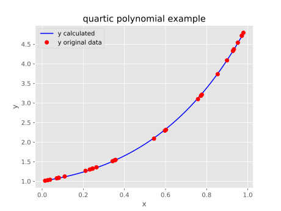

# Symbolic Regression by Uniform Random Global Search
[](https://travis-ci.com/pySRURGS/pySRURGS)
[](https://joss.theoj.org/papers/6c575a3b0604e5c5d4ca31f27d4d182d)
[](https://coveralls.io/github/pySRURGS/pySRURGS)
[](https://www.gnu.org/licenses/gpl-3.0)
[](https://www.python.org)
[](https://zenodo.org/badge/latestdoi/200314164)

Symbolic regression is a type of data analysis problem where you search for the 
equation of best fit for a numerical dataset. This package does this task by 
randomly, with uniform probability of selection, guessing candidate solutions 
and evaluating them. The No Free Lunch Theorem argues that random search should 
be equivalent to other approaches like Genetic Programming when assessing algorithm 
performing over all possible problems. This software should be useful for data analysts
and researchers working on symbolic regression problems.

## Features 

1. Robust parameter fitting
2. Multiprocessing for speed
3. Memoization for speed
4. Avoids many arithmetically equivalent equations
5. Loads data from CSV files
6. Results saved to SQLite file. 
7. Results of new runs are added to results of old runs.
8. User specified number of fitting parameters.
9. User specified number of permitted unique binary trees, which determine the possible equation forms 
10. User specified permitted functions of arity 1 or 2
11. Can also run an exhaustive/brute-force search
12. Can be run in deterministic mode for reproducibility
13. Developed and tested on Python 3.6

## Getting Started

It's a python3 script. Download it and run it via a terminal.

### Prerequisites

You can install the prerequisite packages with pip

```mpmath lmfit sympy pandas numpy parmap tqdm sqlitedict tabulate matplotlib scipy python-coveralls pytest pytest-cov```

### Installing

Clone the repo then install the prerequisites.

```
git clone https://github.com/pySRURGS/pySRURGS.git
cd pySRURGS
pip install -r requirements.txt --user
```

### Command line help

```
python3 pySRURGS.py -h
```

The above command should render the following:

```
usage: pySRURGS.py [-h] [-memoize_funcs] [-single] [-count] [-benchmarks]
                   [-deterministic] [-plotting] [-exhaustive]
                   [-funcs_arity_two FUNCS_ARITY_TWO]
                   [-funcs_arity_one FUNCS_ARITY_ONE]
                   [-max_num_fit_params MAX_NUM_FIT_PARAMS]
                   [-max_permitted_trees MAX_PERMITTED_TREES]
                   [-path_to_db PATH_TO_DB]
                   train iters

positional arguments:
  train                 absolute or relative file path to the csv file housing
                        the training data
  iters                 the number of equations to be attempted in this run

optional arguments:
  -h, --help            show this help message and exit
  -memoize_funcs        memoize the computations. If you are running large
                        `iters` and you do not have massive ram, do not use
                        this option. (default: False)
  -single               run in single processing mode (default: False)
  -count                Instead of doing symbolic regression, just count out
                        how many possible equations for this configuration. No
                        other processing performed. (default: False)
  -benchmarks           Instead of doing symbolic regression, generate the 100
                        benchmark problems. No other processing performed.
                        (default: False)
  -deterministic        If set, the pseudorandom number generator will act in
                        a predictable manner and pySRURGS will produce
                        reproducible results. (default: False)
  -plotting             plot the best model against the data to
                        ./image/plot.png and ./image/plot.svg - note only
                        works for univariate datasets (default: False)
  -exhaustive           instead of running pure random search, do an
                        exhaustive search. Be careful about running this as it
                        may run forever. `iters` gets ignored. (default:
                        False)
  -funcs_arity_two FUNCS_ARITY_TWO
                        a comma separated string listing the functions of
                        arity two you want to be considered.
                        Permitted:add,sub,mul,div,pow (default:
                        add,sub,mul,div,pow)
  -funcs_arity_one FUNCS_ARITY_ONE
                        a comma separated string listing the functions of
                        arity one you want to be considered.
                        Permitted:sin,cos,tan,exp,log,sinh,cosh,tanh (default:
                        None)
  -max_num_fit_params MAX_NUM_FIT_PARAMS
                        the maximum number of fitting parameters permitted in
                        the generated models (default: 3)
  -max_permitted_trees MAX_PERMITTED_TREES
                        the number of unique binary trees that are permitted
                        in the generated models - binary trees define the form
                        of the equation, increasing this number tends to
                        increase the complexity of generated equations
                        (default: 1000)
  -path_to_db PATH_TO_DB
                        the absolute or relative path to the database file
                        where we will save results. If not set, will save
                        database file to ./db directory with same name as the
                        csv file. (default: None)
```

### Important details

All your data needs to be numeric.
Your CSV file should have a header.
Inside the csv, the dependent variable should be the rightmost column.
Do not use special characters or spaces in variable names and start variable names with a letter.

### An example

A sample problem is provided. The filename denotes the true equation.

```
$ winpty python pySRURGS.py -max_num_fit_params 3 -max_permitted_trees 1000 -plotting ./csv/quartic_polynomial.csv 2000
Running in multi processor mode
100%|██████████████████████████████████████████████████████████████████████████████████████████████████████| 2000/2000 [05:22<00:00,  8.22it/s]
Making sure we meet the iters value
  Normalized Mean Squared Error       R^2  Equation, simplified                                                    Parameters
-------------------------------  --------  ----------------------------------------------------------------------  ----------------------------
                    4.24058e-05  0.999999  ((p0 + p1)/(p0*x))**(-p0 + p1 + x) + (p0*x + p0 + p2)**(p2*x/p1)        4.47E+00,3.47E-01,2.25E-01
                    0.000141492  0.999996  (-2*p2*x*(p0*(p1 - x) + x) + (p0*p1*(p1 + x))**x*(p1 - x))/(p1 - x)     1.80E+00,1.34E+00,7.04E-02
                    0.000154517  0.999996  x*(p2/p0)**x*(-p0 + p2)**p2 - (x**p1)**p1 + 1                           4.72E-01,1.17E+00,1.69E+00
                    0.0001829    0.999995  -(p0 + x)*(p1*p2*(p2 - x) - (p2 - x)**x)/(p0**2*p1*p2)                  -2.11E+01,-9.23E-03,1.24E+01
                    0.00021193   0.999995  ((p1**x)**p1 + (x**(-p0 + p2))**p2)*((p1 + x**p2)**x)**(-p0*(p0 - p1))  4.09E-01,1.61E+00,1.75E+00
```



### Database file

The database file is in Sqlite3 format, and we access it using the SqliteDict
package. For example. if we have already run some computations against 
the quartic_polynomial example, then we can run the following to inspect
the results.

```
import pySRURGS
from pySRURGS import Result # Result needs to be in the namespace.
from sqlitedict import SqliteDict
SR_config = pySRURGS.SymbolicRegressionConfig()
path_to_csv = './csv/quartic_polynomial.csv'
path_to_db = './db/quartic_polynomial.db'
with SqliteDict(path_to_db, autocommit=True) as results_dict:
    best_result = results_dict['best_result']
    number_equations = results_dict['n_evals']
result_list, dataset = pySRURGS.get_resultlist(path_to_db, path_to_csv, SR_config)
result_list.sort()
# after running sort, zero^th element is the best result
best_result = result_list._results[0]
print("R^2:", best_result._R2, "Equation:", best_result._simple_equation, 
      "Unsimplified Equation:", best_result._equation)
result_list.print(dataset._y_data)
```

## API
[Documentation](https://pysrurgs.github.io/pySRURGS/)

## Author

**Sohrab Towfighi**

## License

This project is licensed under the GPL 3.0 License - see the [LICENSE](LICENSE) file for details

## How to Cite

If you use this software in your research, then please cite our paper. <br><br>
Towfighi, (2019). pySRURGS - a python package for symbolic regression by uniform random global search. Journal of Open Source Software, 4(41), 1675, https://doi.org/10.21105/joss.01675 <br><br>
[](https://doi.org/10.21105/joss.01675)

## Community

If you would like to contribute to the project or you need help, then please create an issue. 

With regards to community suggested changes, I would comment as to whether it would be within the scope of the project to include the suggested changes. If both parties are in agreement, whomever is interested in developing the changes can make a pull request, or I will implement the suggested changes. 

## Acknowledgments

* Luther Tychonievich created the algorithm mapping integers to full binary trees: [link](https://www.cs.virginia.edu/luther/blog/posts/434.html), [web archived link](http://web.archive.org/web/20190908010319/https://www.cs.virginia.edu/luther/blog/posts/434.html).
* The icon is from the GNOME desktop icons project and the respective artists. Taken from [link](https://commons.wikimedia.org/wiki/GNOME_Desktop_icons#/media/File:Gnome-system-search.svg), [web archived link](https://web.archive.org/web/20151002175042/https://commons.wikimedia.org/wiki/File:Gnome-system-search.svg). License: GPL version 2.0. 
