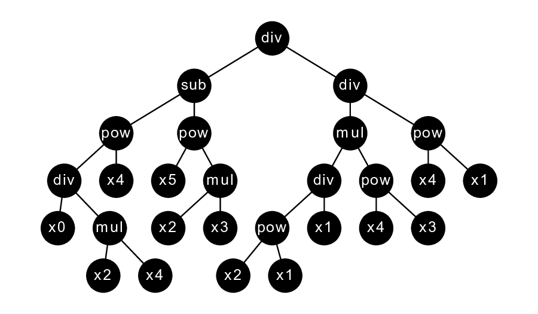

# Summary
Symbolic regression is a regression analysis where we search for the 
mathematical expression that best describes the relationship between our 
independent variables and our dependent variable. ``pySRURGS`` is a python code 
for symbolic regression by uniform random global search. Typically, symbolic
regression problems are solved using genetic programming [@Koza:1994], but the 
data demonstrating that genetic programming outperforms random search 
on symbolic regression problems is lacking. Comparing the performance 
of an algorithm against that of random search demonstrates the advantage gained 
by the algorithm's internal machinery. Our review of the literature found a 
large study examining the parameter space of genetic programming, which found 
few patterns with regards to how users should select genetic algorithm 
hyperparameters [@Sipper:2018]. These workers attempt to compare their genetic 
algoritm's performance to that of random search on several problems, including a 
symbolic regression problem. We reproduce their work and find they unfairly 
disadvantaged the random search by forcing it to only attempt the simplest 
solutions. There is little evidence that genetic algorithms outperform
random search on the symbolic regression problem and the creation of 
``pySRURGS`` addresses this need. 

We use a novel methodology for the enumeration of full binary trees 
[@Tychonievich:2013] and extend it for the symbolic regression problem. This 
enumeration allows us to ensure that all equations have an equal probability of
being selected. ``pySRURGS`` is a command line script, allowing the user to
specify the nature and size of the search space and the number of equations that
will be attempted by the random search. ``pySRURGS`` performs fitting parameter
optimization using Levenburg-Marquardt nonlinear optimization [@Kommenda:2013], 
and leverages a SQLite dictionary along with a symbolic equation simplification 
scheme to minimize repeating calculations. It receives a comma separated value 
file and generates a mathematical equation that predicts the output variable.

``pySRURGS`` was designed to be used by researchers and individuals working on 
applied problems. It allows users to generate benchmark problems in symbolic 
regression and also to enumerate the problem space. Users are allowed to 
specify which functions they want permitted and how many fitting parameters 
they want permitted. The code works very nicely, saving results to a sqlite 
dictionary file for future review. Though intuitive, uniform random global 
search is proven to converge on the ideal solution as the number of iterations 
tends to infinity [@Solis:2012]. In addition, pySRURGS has the capability to 
perform an exhaustive search, which is useful for simpler symbolic regression
problems.

# References
